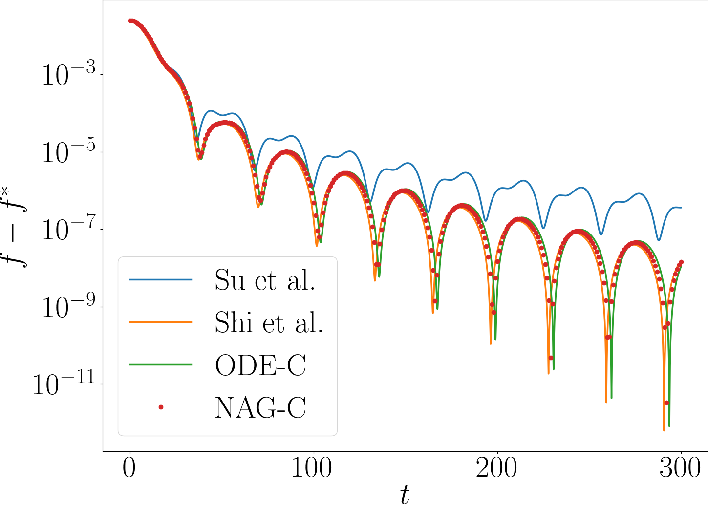

# G-ODE-NAG

This repository contains Jupyter notebooks implementing the code samples found in Generalized Continuous-Time Models for Nesterov’s Accelerated Gradient Methods.

## Requirements
- Python 3.12.4
- Jupyterlab
- scipy
- matplotlib
- numpy

## Experiments
- Ex1 : Comparison of NAG and corresponding ODEs in the convex case
- Ex2 : Comparison of NAG and corresponding ODEs in the strongly convex case
- Ex3 : Difference between NAG and G-ODE according to discretization interval
- Ex4 : Comparison of time-reparametrization of gradient descent and G-ODE
- Ex5 : Restarting scheme for G-ODE and NAG

## Results

