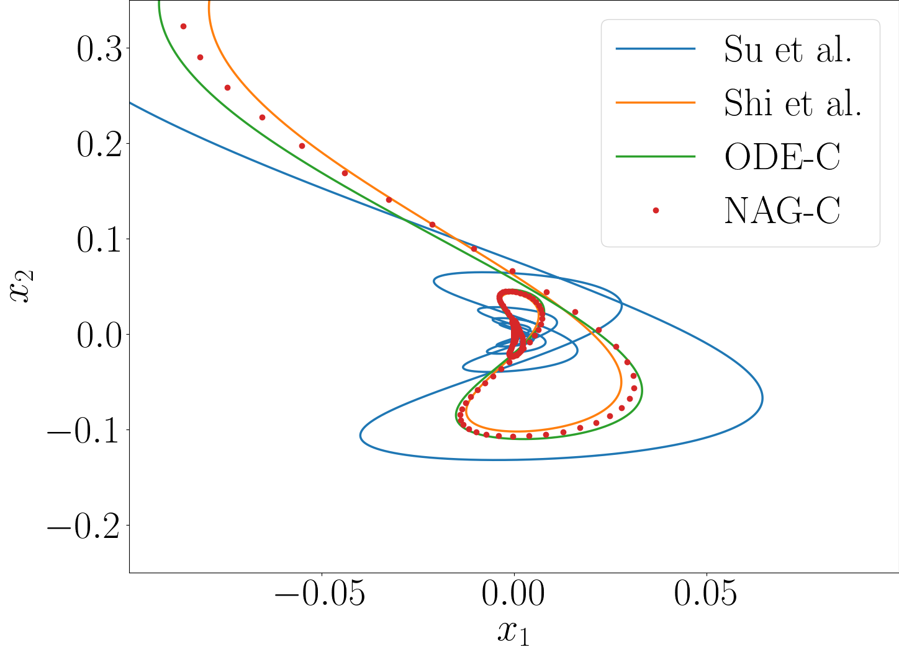

# G-ODE-NAG

This repository contains Jupyter notebooks implementing Generalized Continuous-Time Models for Nesterov’s Accelerated Gradient Methods.

## Requirements
- Python 3.12.4
- Jupyterlab
- scipy
- matplotlib
- numpy

## Experiments
- [Ex1](#./Ex1) : Comparison of NAG and corresponding ODEs in the convex case
- [Ex2](#Ex2) : Comparison of NAG and corresponding ODEs in the strongly convex case
- [Ex3](#Ex3): Difference between NAG and G-ODE according to discretization interval
- [Ex4](#Ex4) : Comparison of time-reparametrization of gradient descent and G-ODE
- [Ex5](#Ex5) : Restarting scheme for G-ODE and NAG

## Examples
- Ex1 : Zoomed Trajectories
  
<figure>
    
</figure>
- Ex1 : Errors

<figure>
    
</figure>
